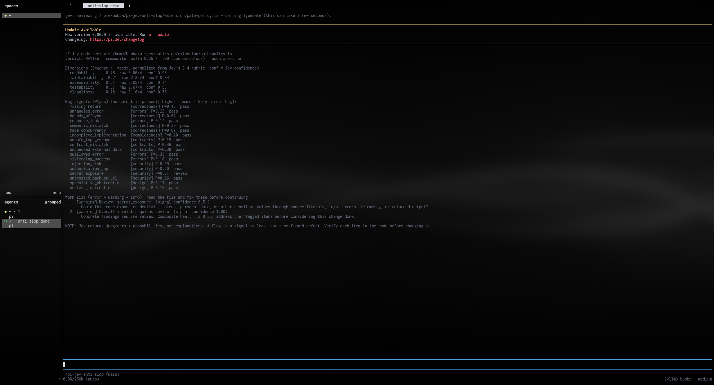

# pi-jev-anti-slop

A **TypeSafe [Jev](https://docs.typesafe.ai)** code-review **judgment** for LLM-agent review loops, packaged as a pi extension.

It scores a file, diff, or named code chunk for **bugs**, **AI-code slop**, **security**, **memory use**, **speed**, and broad **code quality**, composes those signals into a **verdict** (`pass` / `review` / `block`) and a **prioritized flag list**, and hands that to the **main LLM to read the code and fix** — then you re-run until it's clean.



## What Jev checks

Each full or `quality` review scores these dimensions from 0 (worst) to 10 (best), then normalizes them to 0–1 for policy and composite scoring:

- `readability` — naming, control flow, and how easily a new reader can reason about the code;
- `maintainability` — cohesion, coupling, duplication, and change isolation;
- `extensibility` — whether new cases can be added without rewriting core logic;
- `testability` — isolation, side-effect boundaries, and practical test seams;
- `cleanliness` — dead code, noise, consistency, and structural discipline;
- `reliability` — failure behavior, recovery, invariants, retries, and idempotency where needed;
- `security_posture` — secure defaults, trust boundaries, least privilege, and defense in depth;
- `resource_efficiency` — bounded memory and resource lifetimes, allocation, streaming, and backpressure;
- `performance_scalability` — complexity, latency, concurrency, batching, and hot-path work;
- `api_contract_clarity` — explicit inputs, outputs, errors, ownership, and compatibility behavior;
- `observability` — actionable errors, proportionate logs, metrics, traces, and privacy-safe diagnostic context.

The targeted issue battery asks one independent probability question for every check below:

- **Correctness:** `missing_return`, `bounds_offbyone`, `semantic_mismatch`, `race_concurrency`.
- **Completeness:** `incomplete_implementation`.
- **Contracts:** `unsafe_type_escape`, `contract_mismatch`, `unchecked_external_data`.
- **Errors:** `unhandled_error`, `resource_leak`, `swallowed_error`, `misleading_success`.
- **Security:** `injection_risk`, `authorization_gap`, `secret_exposure`, `untrusted_path_or_url`, `unsafe_deserialization`, `cryptographic_weakness`, `insecure_transport`.
- **Memory:** `unbounded_memory_growth`, `retained_reference_leak`, `oversized_materialization`.
- **Performance:** `algorithmic_complexity`, `repeated_expensive_work`, `blocking_hot_path`, `serial_independent_work`.
- **Prose:** `excessive_verbosity`, `repetition_redundancy`, `generic_filler`, `canned_structure`, `choppy_or_fragmented_prose`, `grammar_error`, `usage_error`, `mechanics_error`, `awkward_cadence`, `tone_mismatch`, `audience_mismatch`, `unsupported_claim`, `misleading_certainty`, `fabricated_attribution`, `stale_or_inconsistent_instructions`.
- **Design:** `speculative_abstraction`, `useless_indirection`.

Every check is conditional on relevant material being present. For example, code with no protected action, external URL, cryptographic operation, network transport, large input, or latency-sensitive path should not be flagged for the corresponding issue. Prose checks inspect documentation and natural-language passages—including comments and docstrings—while ignoring executable code, identifiers, and intentional formatting.

> **Mental model.** Jev is a *triage* step, not a reviewer that writes prose. Per the [TypeSafe docs](https://docs.typesafe.ai), System One models return **typed judgments + probabilities** — never free-text explanations. So a flag is a **signal to look**, not a confirmed defect. The main agent reads the actual code and writes the real fix. That round trip is the review loop this extension serves.

---

## The gate

This extension is **active only when `TYPESAFE_API_KEY` is present in the environment** — the same load-time no-op pattern as the `agent-voice` (binary) and `pi-local-cloud-toggle` (config) extensions, keyed on your env var. When the key is absent, the extension registers **nothing**: no `jev_review` tool, no `/jev` command, no status.

One variable does both jobs: it is the **on/off gate** *and* the SDK's **API key** (the `@typesafe-ai/sdk` reads `TYPESAFE_API_KEY` by default), so the key is never echoed into a request body or a log.

> If your key currently lives under a different name (e.g. `JEV_KEY`), rename it to `TYPESAFE_API_KEY`. After setting it, run `/reload` (or start a fresh session) so the extension loads.

---

## Install

From npm:

```sh
pi install npm:pi-jev-anti-slop
```

From GitHub:

```sh
pi install git:github.com/BubbatheVTOG/pi-jev-anti-slop
```

Or, for a local checkout:

```sh
export TYPESAFE_API_KEY="..."   # your TypeSafe key
pi install /abs/path/to/pi-jev-anti-slop
```

Then `/reload`. The `jev_review` tool and `/jev` command appear only while `TYPESAFE_API_KEY` is set.

---

## Usage

### The review loop (LLM-callable)

When the extension is active, the agent gets a `jev_review` tool. In a review loop you say things like *"review `src/foo.ts` before I commit"* and the agent calls:

```text
jev_review(path: "src/foo.ts")          # review one whole file
jev_review(paths: ["src/a.ts", "src/b.ts"]) # review an explicit group
jev_review(directory: "src", extensions: [".ts", ".tsx"]) # scan a codebase area
jev_review(reviewType: "prose", directory: "docs") # targeted documentation batch
jev_review(reviewType: "security", paths: ["src/a.ts", "src/b.ts"])
jev_review(code: "<the diff>")          # review an anonymous changed hunk
jev_review(path: "src/foo.ts", code: "<chunk>") # review a named chunk from a file
jev_review(path: "src/foo.ts", language: "typescript", note: "refactor for the X feature")
```

Combining `path` with `code` enables an efficient **divide-and-conquer search strategy**. The agent can split a large file into cohesive, preferably overlapping chunks; run focused reviews under the original filename; track which regions and boundaries have been covered; and investigate likely security, memory, performance, or correctness problems without repeatedly sending the entire file. A chunk finding is still verified against the full source, and the agent must not claim the whole file is clean until every relevant region and cross-chunk boundary has been checked.

The tool's built-in agent guidance explicitly describes this strategy so an LLM can choose it when a whole-file review would waste context or make a targeted search less efficient.

The agent reads back a structured report. Set `reviewType` to the narrowest relevant scope; `prose` directory scans default to documentation extensions, while other directory scans default to source-code extensions. Batch results are independent and persist in tool-result `details`: every result includes an exact normalized `file` path, its own verdict, flags, and any per-file error. Progress updates identify the current file and completed count. **If `escalate=true` or there are `error` flags, the agent reads that exact file, fixes verified issues, and re-runs** until the file is clear.

### The human command

```text
/jev review all src/foo.ts                      # every score and targeted check
/jev review quality src/foo.ts                  # 0–10 quality scores only
/jev review security src                        # security checks across a directory
/jev review memory src/cache.ts                 # memory checks for one file
/jev review performance src                     # speed/scalability checks across a directory
/jev review prose docs                          # writing review for documentation files
/jev review prose src/parser.ts                 # review comments/docstrings, ignore code
/jev status                                     # key presence, review types, and thresholds
```

After typing `/jev review `, Pi argument completion lists the available review types: `all`, `quality`, `correctness`, `completeness`, `contracts`, `errors`, `security`, `memory`, `performance`, `prose`, and `design`. A directory review uses common source-code extensions; `prose` directory reviews default to Markdown, MDX, text, reStructuredText, and AsciiDoc. Explicit files may use any non-sensitive text-based source format.

The original `/jev review <path>` form remains a backward-compatible alias for `/jev review all <path>`. `/jev status` never prints key characters or key length—only `set` or `unset` and the resolved policy numbers.

### Example report

```text
## Jev review — src/foo.ts
verdict: REVIEW   composite health 0.41 / 1.00   escalate=true

Dimensions (0=worst → 1=best, normalized from Jev's 0–10 rubric; conf = Jev confidence):
  readability              0.62  raw 6.20/10  conf 0.71
  maintainability          0.38  raw 3.80/10  conf 0.66   <-- FLAGGED
  extensibility            0.55  raw 5.50/10  conf 0.52
  testability              0.21  raw 2.10/10  conf 0.73   <-- FLAGGED
  cleanliness              0.49  raw 4.90/10  conf 0.44   <-- FLAGGED

Issue signals (P(yes) the issue is present; higher = more likely a real finding):
  missing_return     P=0.12  pass
  unhandled_error    P=0.68  review
  bounds_offbyone    P=0.04  pass
  resource_leak      P=0.31  pass
  semantic_mismatch  P=0.55  review
  race_concurrency   P=0.02  pass

Work list (error → warning → info); read the file and fix these before continuing:
  1. [warning] Review: unhandled_error  (signal confidence 0.68)
       Is there any fallible operation … whose failure path is never handled …
  2. [warning] Improve: testability  (signal confidence 0.73)
       testability scored 0.21 (below the 0.5 bar). Read the file and improve …
  ...
```

---

## Architecture

```text
extension/
  index.ts         # factory: the GATE (no key → register nothing) + wiring
  availability.ts  # pure env gate: hasKey() / resolveKey() / keyMasked()  (mirrors agent-voice)
  types.ts         # SDK-free shared types + the judgment vocabulary (dims, bug classes, rubric size)
  config.ts        # the policy: thresholds + weights, overridable via a `jev` settings block
  questions.ts     # the rubric — the ONLY place judgment wording lives (score + noul questions)
  review.ts        # thin SDK boundary: one systemOne() call over shared state → raw judgments
  compose.ts       # PURE policy: raw judgments → verdict + flags (no SDK, no I/O) + the renderer
  path-policy.ts   # project confinement + sensitive-file rejection for review targets
  jev-tool.ts      # the LLM-callable `jev_review` tool
  jev-command.ts   # the human `/jev review` / `/jev status` command
tests/
  compose.test.ts     # pure composition and targeted-review behavior
  jev-command.test.ts # review-type completion and command parsing
  jev-tool.test.ts    # filename-plus-chunk selection and safety
  questions.test.ts   # 0–10 and targeted question selection
  readme.test.ts      # keeps every dimension/check and strategy documented
  review.test.ts      # response validation for the 0–10 range
  security.test.ts    # key-redaction, confinement, and config validation
```

**Design choices (each grounded in the live docs):**

- **One request, many questions.** All quality-dimension `score`s and all bug-class `nouls` share a single `state` (the code) and run in **one** call — the [`parallel questions` cookbook](https://docs.typesafe.ai/cookbooks/parallel_questions.md) (cheaper + faster, identical answers).
- **Composite scoring, not a classifier.** Each quality dimension is an independent [`Score`](https://docs.typesafe.ai/primitives/score.md); code normalizes `score/(levels-1)` and weights it — the [`composite scoring` pattern](https://docs.typesafe.ai/patterns/composite-scoring.md). Weights/thresholds live in code, so **changing a weight never re-calls the API** (raw judgments are kept and reusable). Composite health is reported as context, but composite-only scores do not escalate a file without a concrete bug, flagged dimension, or uncertainty signal.
- **De-slop detection as a categorized `Noul` battery.** Each high-signal correctness, completeness, contract, error, security, memory, performance, prose, or design check is one narrow [`Noul`](https://docs.typesafe.ai/primitives/noul.md), thresholded in code — the [`guardrails for LLMs` cookbook](https://docs.typesafe.ai/cookbooks/llm_guardrails.md) (pass / review / block routing). Reports retain the existing `bugSignals` field and add a `category` to each signal, preserving existing consumers.
- **Targeted review types.** Both `jev_review(reviewType, ...)` and `/jev review <review-type> <file-or-directory>` send only the score or issue questions relevant to that type. This reduces cost and noise when searching specifically for security, memory, performance, prose, or another category; `all` retains the complete review. Tool batches persist structured per-file reports, progress, truncation state, and isolated errors in result details.
- **Documentation and prose de-slopping.** The `prose` type checks style, factual support, grammar, usage, mechanics, cadence, tone, audience fit, stale instructions, and common LLM-writing artifacts. It can review documentation files or natural-language comments/docstrings in source without treating executable code as prose.
- **Efficient divide-and-conquer searches.** `jev_review(path, code)` associates a focused chunk or diff with its real source filename. Agent guidance recommends cohesive overlapping chunks, explicit coverage tracking, full-file verification of findings, and boundary checks so targeted searches save context without pretending that an isolated chunk proves the whole file is clean.
- **Confidence is a second axis, not a truth value.** A low-confidence *failing* dimension is marked **uncertain** (escalate, don't hard-flag) — [`confidence`](https://docs.typesafe.ai/confidence.md) is distribution concentration, not correctness.
- **Policy in code, raw judgments reusable.** The verdict and flag list are a pure function of `(raw, config)` (`compose.ts`). The report keeps the raw judgments so policy can change without a second API call.
- **Freshness.** A review is about the code *as it is now*; nothing is cached — a review loop re-runs on the current code after each change.
- **SDK boundary is one thin module.** `review.ts` is the only file that touches `@typesafe-ai/sdk` at runtime; `compose.ts` is pure and unit-testable without a key. No `model` is ever hardcoded — the SDK uses its current default.

---

## Configuration

All knobs live in `config.ts` (`DEFAULTS`). You can override any of them in a **global** `~/.pi/agent/settings.json` or a **trusted project's** `.pi/settings.json` under a `jev` block (later layers win, mirroring the cloud/voice toggle precedence). Unknown keys and out-of-range values are ignored. Malformed JSON fails visibly instead of silently reporting defaults.

| Key | Default | Meaning |
| --- | --- | --- |
| `dimensionWeights` | `{readability:1.0, maintainability:1.2, extensibility:0.8, testability:1.2, cleanliness:0.8, reliability:1.2, security_posture:1.2, resource_efficiency:1.0, performance_scalability:1.0, api_contract_clarity:1.0, observability:0.8}` | Relative weight of each dimension in the composite (renormalized to sum 1). |
| `dimensionFlagBelow` | `0.5` | A dimension scoring below this (0..1) is flagged. |
| `confidenceFloor` | `0.5` | A *flagged* dimension below this confidence becomes **uncertain** (escalate, don't hard-flag). |
| `bugReviewThreshold` | `0.5` | P(yes) at/above which a bug signal routes to **review**. |
| `bugBlockThreshold` | `0.85` | P(yes) at/above which a bug signal routes to **block** (must fix). |
| `compositeReviewBelow` | `0.6` | Composite context threshold; does not escalate by itself. |
| `compositeBlockBelow` | `0.4` | Composite context threshold; concrete findings still control escalation. |
| `bugPenaltyWeight` | `2.0` | How strongly the worst bug probability drags the composite down. |

```jsonc
// ~/.pi/agent/settings.json  (or a trusted project's .pi/settings.json)
{
  "jev": {
    "bugBlockThreshold": 0.8,
    "dimensionWeights": { "testability": 2.0, "cleanliness": 0.5 }
  }
}
```

> **Tuning.** These are **starting points, not rules**. The docs are explicit that cookbook thresholds are *examples to evaluate, not universal limits*. Jev is a trained, calibrated decision model — **validate its behavior on your own code** and adjust until the flag rate matches your tolerance.

---

## Development

```sh
npm install          # deps (@typesafe-ai/sdk) + dev deps (typescript, @types/node)
npm run typecheck    # tsc --noEmit
npm test             # node --test tests/*.test.ts  (pure composition logic; no API)
```

The unit tests exercise the verdict/escalation matrix with a mocked raw-judgment shape (the exact shape `runReview` produces) — clean code → pass, a block-level bug → block + escalate, categorized de-slop findings → actionable review, a low-confidence failing dimension → uncertainty (not a hard flag), and composite policy re-scoring the same raw without an API call.

---

## Limitations (read this)

- **A flag is not a proof.** Typed output guarantees the *interface*, not the *truth*. Treat every flag as a hypothesis to verify in the code.
- **Jev accepts text only** (no images/audio/video). Its primary language is English; other languages work but with lower accuracy.
- **It reviews what it's shown.** Pass a diff for a change-level review; it can't see code it wasn't given. Large whole-file reviews are truncated (see `MAX_CODE_CHARS`). Use `path` plus `code` for a named chunk and a divide-and-conquer search, but remember that isolated chunks can miss cross-boundary control flow, shared state, and interactions with code outside the chunk. Prose accuracy checks can identify unsupported, contradictory, stale, or overconfident claims in the supplied context; they cannot independently fact-check information that is absent from that context.
- **It does not explain or fix.** Wording in flags is authored by this extension from the judgment text; the explanation and the fix come from the main LLM (or you).
- **Cost/latency.** One `systemOne` call is made per file or supplied chunk. A directory or group review therefore costs one request per discovered file, while divide-and-conquer review costs one request per chunk; `maxFiles` defaults to 200 for directory scans. Measure your real budget and choose chunk sizes that reduce context without creating excessive calls.

## Security

- The key is the gate and is read only from the environment by the SDK; it is never written into the request or any log.
- Status displays reveal only `set` or `unset`; they never expose key characters or length.
- File and directory targets are confined to the current project root after resolving symlinks.
- Likely credential files such as `.env`, `.npmrc`, private keys, and credential JSON files are rejected before code is sent to TypeSafe.
- High-confidence credential shapes—including private-key blocks, common provider tokens, and credential assignments—are replaced with `[REDACTED]` before file or inline code is sent.
- Redaction is defense in depth, not a complete secret scanner; do not deliberately submit credentials.
- Keep the key server-side; this extension never persists it.
